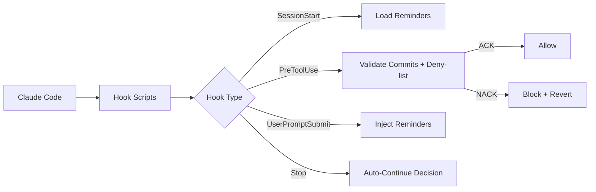

# Ketchup

**Turn every AI mistake into a rule AI can't repeat.**

Ketchup runs 15+ LLM-powered guardrails on every AI commit, so bad commits don't land.

[](https://github.com/BeOnAuto/auto-ketchup/actions) [](https://www.npmjs.com/package/auto-ketchup) [](LICENSE) []()

```
/plugin install auto-ketchup
```

*Ketchup is an open-source guardrail engine for Claude Code, from the team at [Auto](https://on.auto).*

> Today: Claude Code only. If your agent exposes hooks or an equivalent integration surface, [open an issue](https://github.com/BeOnAuto/auto-ketchup/issues).

---

## Why

AI coding agents have three problems: they're biased for delivery, they have no negative knowledge about your system, and every prompt is a clean slate that forgets yesterday's lessons. Static tools (eslint, husky, commitlint) can't catch semantic failures: a test that asserts nothing, a commit that bundles three unrelated concerns, a "fix" that rationalizes a shortcut, an architectural rule violated three months after you wrote it.

Ketchup runs a separate Claude subagent against every commit, with your rules as its context and no investment in whether the commit ships. When it finds a violation, it blocks the commit and tells you why.

The workflow is: observe an AI mistake, encode it as a rule, AI can't repeat it. The codebase gets permanently safer as you keep working, not just temporarily cleaner. See [Guardrail Engineering](./docs/guardrail-engineering.md) for the mechanism and [the Ketchup Technique](./docs/ketchup-technique.md) for the planning rhythm that feeds clean work into it.

## In the stack

Ketchup comes from the team building [Auto](https://on.auto), a spec-driven development platform. Auto decides what to build. Ketchup enforces how. Use them together, or use Ketchup on its own. Both work.

## Key Concepts

- **Hooks**: Four integration points (SessionStart, PreToolUse, UserPromptSubmit, Stop) that let Ketchup observe and control Claude Code's behavior
- **Validators**: Markdown files with YAML frontmatter that ACK or NACK commits based on your criteria
- **Reminders**: Context-injection files that surface your guidelines at the right moment
- **Deny-list**: Glob patterns that protect files from modification
- **TCR Discipline**: Test && Commit || Revert. Bad code auto-reverts.
- **Auto-Continue**: Keeps the agent going until the plan is done

---

## Installation

### From the Marketplace (recommended)

Inside any Claude Code session:

```
/plugin marketplace add BeOnAuto/auto-plugins
/plugin install auto-ketchup
```

### As a Local Plugin

```bash
claude --plugin-dir /path/to/auto-ketchup
```

Claude Code sets `CLAUDE_PLUGIN_ROOT` and `CLAUDE_PLUGIN_DATA` automatically. Run `/auto-ketchup-init` inside a session to activate per-project configuration, validators, and logging.

## Quick Start

```bash
# Marketplace (inside Claude Code)
/plugin marketplace add BeOnAuto/auto-plugins
/plugin install auto-ketchup

# Or local plugin mode
claude --plugin-dir /path/to/auto-ketchup
```

After installation, Claude will mention that Ketchup is available. To activate it in a project:

```
/auto-ketchup-init
```

This creates `.ketchup/` with default configuration. You can add it to `.gitignore` for personal use, or commit it for the whole team.

If you're upgrading from `claude-auto`, your existing `.claude-auto/` directory will be auto-renamed to `.ketchup/` on first session-start. No manual action required.

**Next steps:**

- [Getting Started guide](./docs/getting-started.md)
- [The Ketchup Technique](./docs/ketchup-technique.md)
- [In the Stack](./docs/in-the-stack.md)

---

## Custom Validators and Reminders

Add project-specific rules by creating markdown files in `.ketchup/validators/` and `.ketchup/reminders/`.

### Custom Validator

Create `.ketchup/validators/my-rule.md`:

```markdown
---
name: my-rule
description: Enforce my custom rule
enabled: true
---

You are validating a git commit. Check that [your criteria here].

Respond with JSON only:
- If the commit passes: {"decision":"ACK"}
- If the commit fails: {"decision":"NACK","reason":"explanation"}
```

Validators receive the staged diff, file list, and commit message. They must return ACK or NACK as JSON.

### Custom Reminder

Create `.ketchup/reminders/my-reminder.md`:

```markdown
---
when:
  hook: UserPromptSubmit
priority: 50
---

Your reminder content here. This gets injected on every prompt.
```

The `when` field controls when the reminder fires:

| Condition | Fires when |
|-----------|-----------|
| `hook: SessionStart` | Once at session start |
| `hook: UserPromptSubmit` | Every user prompt |
| `hook: PreToolUse` | Before tool execution |
| `hook: PreToolUse` + `toolName: Bash` | Only before Bash tool |
| _(no `when`)_ | All hooks |

Higher `priority` = appears first. Project-local files are loaded alongside plugin defaults. If filenames collide, plugin versions take precedence.

### Runtime Configuration

Toggle validators and reminders without editing files:

```bash
/auto-ketchup-config show
/auto-ketchup-config validators disable no-comments
/auto-ketchup-config reminders priority my-reminder 200
/auto-ketchup-config reminders add my-rule --hook UserPromptSubmit --priority 50 --content "Always use early returns"
```

---

### Multiply with Git Worktrees

```bash
git worktree add ../feature-auth feature/auth
git worktree add ../feature-payments feature/payments
```

Each worktree runs its own Ketchup instance, all quality-validated.

---

### Configuration

```json
{
  "autoContinue": { "mode": "smart" },
  "validateCommit": { "mode": "strict", "batchCount": 3 },
  "denyList": { "enabled": true },
  "promptReminder": { "enabled": true },
  "subagentHooks": {
    "validateCommitOnExplore": false,
    "validateCommitOnWork": true,
    "validateCommitOnUnknown": true
  }
}
```

Configuration lives in `.ketchup/.claude.hooks.json`. See the [Configuration guide](./docs/configuration.md) for all options.

---

## How It Works



Hook scripts read JSON from stdin, delegate to handlers in `src/hooks/`, log results, and output JSON to stdout. Validators are batched (default 3 per Claude CLI call) for efficient parallel validation. Reminders are matched by hook type, mode, and tool name, then injected as `<system-reminder>` blocks.

---

## Roadmap

Ketchup is Claude Code-first today. The Ketchup Technique (the methodology) works with any AI coding agent by hand. If your agent exposes hooks or an equivalent integration surface, [open an issue](https://github.com/BeOnAuto/auto-ketchup/issues) so we can scope adapter work.

---

## Troubleshooting

### Hooks Not Firing

**Symptom:** Commits go through without validation.

**Cause:** Plugin not installed or not enabled.

**Solution:**

```
/plugin install auto-ketchup
```

### Enable Debug Logging

```bash
DEBUG=auto-ketchup claude --plugin-dir /path/to/auto-ketchup
```

`DEBUG=auto-ketchup` writes diagnostics to `.ketchup/logs/auto-ketchup/debug.log`.

---

## Documentation

| Guide | Description |
| ----- | ----------- |
| [Getting Started](./docs/getting-started.md) | First-time setup and core concepts |
| [Installation](./docs/installation.md) | Detailed installation guide |
| [The Ketchup Technique](./docs/ketchup-technique.md) | The planning methodology |
| [In the Stack](./docs/in-the-stack.md) | How Ketchup fits with Auto and spec-driven development |
| [Configuration](./docs/configuration.md) | All configuration options |
| [Hooks Guide](./docs/hooks-guide.md) | Hook system deep-dive |
| [Reminders Guide](./docs/reminders-guide.md) | Context injection system |
| [Validators Guide](./docs/validators-guide.md) | Commit validation rules |
| [API Reference](./docs/api-reference.md) | Programmatic access |
| [Architecture](./docs/architecture.md) | System design internals |
| [Origin Story](./docs/origin-story.md) | How Ketchup came to be |

---

## Architecture

```
.claude-plugin/
└── plugin.json           # Plugin manifest (name, version, description)
hooks/
└── hooks.json            # Plugin hook definitions (SessionStart, PreToolUse, etc.)
validators/               # Default commit validators (17 rules)
reminders/                # Default context-injection reminders (10 files)
agents/                   # Sub-agent definitions (validator agent)
src/
├── brand.ts              # BRAND constants (single source of truth for naming)
├── hooks/                # Hook handlers (session-start, pre-tool-use, user-prompt-submit, auto-continue)
├── migrate.ts            # .claude-auto -> .ketchup auto-migration
├── path-resolver.ts      # Plugin-mode path resolution
├── commit-validator.ts   # Batched commit validation with appeal support
├── deny-list.ts          # File protection via micromatch patterns
├── reminder-loader.ts    # Multi-directory reminder system with deduplication
├── hook-state.ts         # Hook state management (.claude.hooks.json)
├── validator-loader.ts   # Multi-directory validator loader
└── index.ts              # Public API barrel exports
scripts/
├── session-start.ts      # SessionStart hook entry-point (runs migration first)
├── pre-tool-use.ts       # PreToolUse hook entry-point
├── user-prompt-submit.ts # UserPromptSubmit hook entry-point
└── auto-continue.ts      # Stop hook entry-point
```

### Dependencies

| Package | Usage |
| ------- | ----- |
| gray-matter | YAML frontmatter parsing for validators and reminders |
| micromatch | Glob pattern matching for deny-lists |

---

## Development

### Prerequisites

- Node.js 18+
- pnpm 10+

### Setup

```bash
git clone https://github.com/BeOnAuto/auto-ketchup.git
cd auto-ketchup
pnpm install
pnpm build
```

### Commands

| Command | Description |
| ------- | ----------- |
| `pnpm build` | TypeScript compile + esbuild bundle scripts |
| `pnpm test` | Run all tests (vitest) |
| `pnpm type-check` | TypeScript type checking |
| `pnpm lint` | Biome lint check |
| `pnpm check` | Full CI: build + type-check + test + lint |

---

## License

MIT &copy; 2025 BeOnAuto, Inc.

See [LICENSE](LICENSE) for details.
